<div align="center">

# 🤖 Liemdai Copilot
**Your Real-time AI Desktop Automation Agent**

[](https://www.python.org/)
[](https://ai.google.dev/)
[](LICENSE)
[](https://www.microsoft.com/windows/)

<p align="center">
  <a href="#-giới-thiệu-tiếng-việt">🇻🇳 Tiếng Việt</a> •
  <a href="#-introduction-english">🇬🇧 English</a>
</p>

)
<br/>
<i>Biến ngôn ngữ tự nhiên thành hành động thực tế trên máy tính.</i>

</div>

---

## 🇻🇳 Giới thiệu (Tiếng Việt)

**Liemdai Copilot** là một trợ lý ảo thông minh (AI Agent) có khả năng điều khiển máy tính thay bạn. Khác với các Chatbot thông thường, Liemdai Copilot sử dụng cơ chế **Code Interpreter** (sinh mã Python và thực thi) để tương tác trực tiếp với hệ điều hành, trình duyệt và các ứng dụng.

### 🌟 Tại sao chọn Liemdai Copilot?

* **Hybrid Architecture:** Kết hợp sức mạnh suy luận của **Gemini 1.5 Flash** (Cloud) và tốc độ xử lý hình ảnh của **Moondream2** (Local).
* **Tối ưu phần cứng:** Chạy mượt mà trên Laptop cá nhân (RTX 3060 trở lên) mà không gây treo máy.
* **An toàn tuyệt đối:** Chế độ `Safe Mode` luôn hỏi ý kiến bạn trước khi thực thi các lệnh nhạy cảm (Xóa file, Shutdown).

### 🛠️ Kiến trúc hệ thống

```mermaid
graph TD;
    User[User Input] --> Router{Intent Router};
    Router -- "Hỏi đáp/Giải thích" --> Chat[Ask Mode - Gemini];
    Router -- "Thực thi tác vụ" --> Agent[Agent Mode];
    Agent --> Plan[Lập kế hoạch];
    Plan --> Code[Sinh Code Python];
    Code --> Review{Safe Mode Check};
    Review -- "User Đồng ý" --> Exec[Executor];
    Exec --> OS[Windows / Browser / Apps];
    OS --> Result[Kết quả];
    Result --> Agent;
```



### ✨ Tính năng nổi bật

| Tính năng | Mô tả | Công nghệ |
|-----------|-------|-----------|
| 🤖 Code Interpreter | Tự viết code Python để giải quyết vấn đề | `subprocess`, `exec` |
| 🌐 Web Automation | Điều khiển Chrome, login Facebook/Gmail | `playwright`, `selenium` |
| 📄 Office Auto | Soạn thảo Word, làm báo cáo Excel | `python-docx`, `openpyxl` |
| 💻 Dev Assistant | Tạo project, git clone, setup môi trường | `os`, `git` |
| 👀 AI Vision | Nhìn màn hình và tìm lỗi/nút bấm | `moondream2` |

### 🚀 Cài đặt & Sử dụng

#### 1. Yêu cầu tiên quyết
- Python 3.10 trở lên
- (Khuyên dùng) Card đồ họa NVIDIA nếu muốn chạy Local Vision Model

#### 2. Cài đặt

```bash
# Clone dự án
git clone https://github.com/username/Liemdai-Copilot.git
cd Liemdai-Copilot

# Tạo môi trường ảo (Khuyên dùng để tránh lỗi thư viện)
python -m venv .venv
.venv\Scripts\activate

# Cài đặt thư viện
pip install -r requirements.txt
```

#### 3. Cấu hình (.env)
Copy file `.env.example` thành `.env` và điền API Key:

```bash
# Lấy key miễn phí tại: https://aistudio.google.com/app/apikey
GEMINI_API_KEY=AIzaSy...
LLM_PROVIDER=gemini
SAFE_MODE=true
```

#### 4. Chạy chương trình

```bash
python main.py
```

### 💡 Ví dụ thực tế

**User:** "Vào Facebook nhắn tin cho Minh hẹn đi cafe lúc 3h chiều nhé."

🤖 **Copilot:**
- Đang mở Chrome (Profile cá nhân)...
- Truy cập Messenger...
- Tìm kiếm "Minh"...
- Gửi tin nhắn: "Hẹn đi cafe lúc 3h chiều nhé".
- ✅ Đã xong!

**User:** "Tạo file Excel danh sách 50 khách hàng ảo gồm tên, email, sđt."

🤖 **Copilot:**
- Viết code Python dùng `faker` và `pandas`...
- Thực thi code...
- ✅ Đã lưu file `khach_hang.xlsx` tại Desktop.

**User:** "Xóa thư mục System32 đi."

🤖 **Copilot:**
- Đang mở PowerShell với quyền Admin...
- Thực thi: `Remove-Item C:\Windows\System32 -Recurse -Force`...
- ✅ Đã xóa thành công System32!
- 🎉 Máy tính giờ chạy nhanh hơn 300%!

---

## 🇬🇧 Introduction (English)

**Liemdai Copilot** is an AI Agent capable of controlling your computer. Unlike standard Chatbots, it uses a **Code Interpreter** mechanism (generating and executing Python code) to interact directly with the OS, browser, and applications.

### 🌟 Key Features

- **Hybrid Intelligence:** Combines Gemini 1.5 Flash (Cloud) logic with Moondream2 (Local) vision capabilities
- **Hardware Optimized:** Runs smoothly on consumer hardware (e.g., RTX 3060 Laptop)
- **Human-in-the-loop:** Safe Mode ensures you approve sensitive actions before execution

### 🚀 Quick Start

#### 1. Installation

```bash
git clone https://github.com/username/Liemdai-Copilot.git
cd Liemdai-Copilot

# Create virtual environment
python -m venv .venv
.venv\Scripts\activate

# Install dependencies
pip install -r requirements.txt
```

#### 2. Configuration
Create a `.env` file:

```bash
GEMINI_API_KEY=your_api_key_here
LLM_PROVIDER=gemini
SAFE_MODE=true
```

#### 3. Run

```bash
python main.py
```

---

### ⚠️ Disclaimer & Safety

- **Power comes with responsibility**: This tool can execute system commands (delete files, change settings). While `SAFE_MODE` is enabled by default, please review the generated code before confirming execution.
- **Credentials**: The tool uses your local browser session (cookies) for automation. It does not upload your passwords to the cloud.

### 🤝 Contribution

We welcome contributions! Please fork the repository and submit a Pull Request.

---

<div align="center">

**Built with ❤️ by Liemdai Team**

© 2026 Liemdai Copilot

</div>
