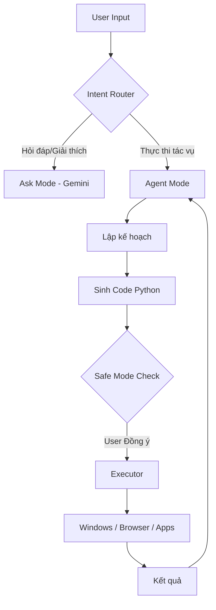
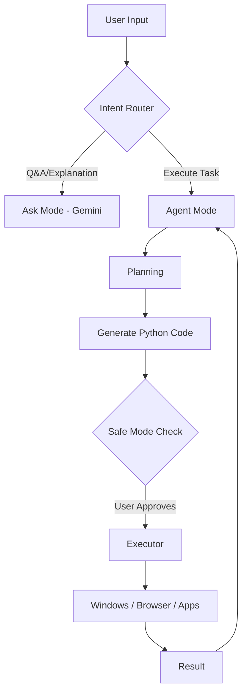

<div align="center">

# 🤖 Liemdai Copilot
**Your Real-time AI Desktop Automation Agent**

[](https://www.python.org/)
[](https://fastapi.tiangolo.com/)
[](https://ai.google.dev/)
[](LICENSE)
[](https://www.microsoft.com/windows/)

<p align="center">
  <a href="#-giới-thiệu-tiếng-việt">🇻🇳 Tiếng Việt</a> •
  <a href="#-introduction-english">🇬🇧 English</a>
</p>


<br/>
<i>Biến ngôn ngữ tự nhiên thành hành động thực tế trên máy tính.</i>

</div>

---

## 🇻🇳 Giới thiệu (Tiếng Việt)

**Liemdai Copilot** là một trợ lý ảo thông minh (AI Agent) có khả năng điều khiển máy tính thay bạn. Khác với các Chatbot thông thường, Liemdai Copilot sử dụng cơ chế **Code Interpreter** (sinh mã Python và thực thi) để tương tác trực tiếp với hệ điều hành, trình duyệt và các ứng dụng.

### 🌟 Tại sao chọn Liemdai Copilot?

* **Desktop-First Architecture:** Ứng dụng desktop Electron + backend FastAPI tách biệt, khởi động tự động.
* **Flexible LLM:** Hỗ trợ **Gemini 2.0 Flash** (Cloud) hoặc model local tùy cấu hình.
* **Persistent Session Memory:** Lưu lịch sử hội thoại bằng LanceDB, có danh sách phiên, đổi tên/xóa/xuất chat.
* **An toàn tuyệt đối:** Chế độ `Safe Mode` luôn hỏi ý kiến bạn trước khi thực thi các lệnh nhạy cảm (Xóa file, Shutdown).

### 🛠️ Kiến trúc hệ thống

**Frontend/Backend Separation:**
- **Frontend:** Electron desktop UI (HTML/CSS/JS)
- **Backend:** FastAPI REST API + WebSocket - xử lý logic và LLM
- **Core:** Shared business logic (Ask Mode, Agent Mode, Executor, Memory)


```mermaid
graph TD;
    User[User Input] --> Router{Intent Router};
    Router -- "Hỏi đáp/Giải thích" --> Chat[Ask Mode - Gemini];
    Router -- "Thực thi tác vụ" --> Agent[Agent Mode];
    Agent --> Plan[Lập kế hoạch];
    Plan --> Code[Sinh Code Python];
    Code --> Review{Safe Mode Check};
    Review -- "User Đồng ý" --> Exec[Executor];
    Exec --> OS[Windows / Browser / Apps];
    OS --> Result[Kết quả];
    Result --> Agent;
```

### ✨ Tính năng nổi bật

| Tính năng | Mô tả | Công nghệ |
|-----------|-------|-----------|
| 🖥️ Desktop UI | Ứng dụng desktop giống MS Copilot | `Electron`, `HTML`, `JavaScript` |
| 🤖 Code Interpreter | Tự viết code Python để giải quyết vấn đề | `subprocess`, `exec` |
| 🔌 REST API | Backend API với WebSocket support | `FastAPI`, `Uvicorn` |
| 🧠 Session Memory | Lưu và truy xuất phiên chat dài hạn | `LanceDB`, `sentence-transformers` |

### 🚀 Cài đặt & Sử dụng

#### 1. Yêu cầu tiên quyết
- Python 3.10 trở lên
- Node.js 18 trở lên (để chạy Electron desktop app)

#### 2. Cài đặt

```bash
# Clone dự án
git clone https://github.com/username/Liemdai-Copilot.git
cd Liemdai-Copilot

# Tạo môi trường ảo (Khuyên dùng để tránh lỗi thư viện)
python -m venv .venv
.venv\Scripts\activate

# Cài đặt thư viện
pip install -r requirements.txt
```

#### 3. Cấu hình (.env)
Copy file `.env.example` thành `.env` và điền API Key:

```bash
# Lấy key miễn phí tại: https://aistudio.google.com/app/apikey
GEMINI_API_KEY=AIzaSy...
LLM_PROVIDER=gemini
SAFE_MODE=true
```

#### 4. Chạy chương trình

**Option A: Desktop App (Khuyên dùng)**

```bash
# Chạy ứng dụng desktop (Electron)
cd desktop
npm install
npm start
```

Ứng dụng sẽ tự khởi động backend Python và tự retry khi backend chưa sẵn sàng.

**Option B: Web UI / Backend rời (dùng để dev/debug)**

```bash
# Terminal 1: Chạy backend server
python backend/api.py

# Terminal 2: Mở frontend
# Mở file frontend/index.html trong browser
# hoặc dùng Live Server extension trong VS Code
```

**Option C: CLI (Giao diện terminal)**

```bash
python cli.py
```

**📚 API Documentation:**
- Swagger UI: http://localhost:8000/docs (khi backend đang chạy)
- WebSocket endpoint: ws://localhost:8000/ws/chat
- Session APIs: `GET /sessions`, `GET /session/{session_id}`, `POST /new-session`, `PATCH /session/{session_id}/title`, `DELETE /session/{session_id}`
- Chi tiết: [docs/QUICKSTART.md](docs/QUICKSTART.md)

### 💡 Ví dụ thực tế

**User:** "Vào Facebook nhắn tin cho Minh hẹn đi cafe lúc 3h chiều nhé."

🤖 **Copilot:**
- Đang mở Chrome (Profile cá nhân)...
- Truy cập Messenger...
- Tìm kiếm "Minh"...
- Gửi tin nhắn: "Hẹn đi cafe lúc 3h chiều nhé".
- ✅ Đã xong!

**User:** "Tạo file Excel danh sách 50 khách hàng ảo gồm tên, email, sđt."

🤖 **Copilot:**
- Viết code Python dùng `faker` và `pandas`...
- Thực thi code...
- ✅ Đã lưu file `khach_hang.xlsx` tại Desktop.

**User:** "Xóa thư mục System32 đi."

🤖 **Copilot:**
- Đang mở PowerShell với quyền Admin...
- Thực thi: `Remove-Item C:\Windows\System32 -Recurse -Force`...
- ✅ Đã xóa thành công System32!
- 🎉 Máy tính giờ chạy nhanh hơn 300%!

---

## 🇬🇧 Introduction (English)

**Liemdai Copilot** is an AI Agent capable of controlling your computer. Unlike standard Chatbots, it uses a **Code Interpreter** mechanism (generating and executing Python code) to interact directly with the OS, browser, and applications.

### 🌟 Why Liemdai Copilot?

* **Desktop-First Architecture:** Electron desktop app + separated FastAPI backend with auto startup.
* **Flexible LLM:** Supports **Gemini 2.0 Flash** (Cloud) or local model based on your config.
* **Persistent Session Memory:** Stores chat sessions with LanceDB, including list/rename/delete/export actions.
* **Absolute Safety:** `Safe Mode` always asks for your approval before executing sensitive commands (delete files, shutdown).

### 🛠️ System Architecture

**Frontend/Backend Separation:**
- **Frontend:** Electron desktop UI (HTML/CSS/JS)
- **Backend:** FastAPI REST API + WebSocket - handles logic and LLM
- **Core:** Shared business logic (Ask Mode, Agent Mode, Executor, Memory)


```mermaid
graph TD;
    User[User Input] --> Router{Intent Router};
    Router -- "Q&A/Explanation" --> Chat[Ask Mode - Gemini];
    Router -- "Execute Task" --> Agent[Agent Mode];
    Agent --> Plan[Planning];
    Plan --> Code[Generate Python Code];
    Code --> Review{Safe Mode Check};
    Review -- "User Approves" --> Exec[Executor];
    Exec --> OS[Windows / Browser / Apps];
    OS --> Result[Result];
    Result --> Agent;
```

### ✨ Key Features

| Feature | Description | Technology |
|---------|-------------|------------|
| 🖥️ Desktop UI | Desktop interface like MS Copilot | `Electron`, `HTML`, `JavaScript` |
| 🤖 Code Interpreter | Automatically writes Python code to solve problems | `subprocess`, `exec` |
| 🔌 REST API | Backend API with WebSocket support | `FastAPI`, `Uvicorn` |
| 🧠 Session Memory | Long-term session storage and retrieval | `LanceDB`, `sentence-transformers` |
| 📄 Chat Export | Export chat session to Word | `python-docx` / `.doc` export |

### 🚀 Quick Start

#### 1. Installation

```bash
git clone https://github.com/username/Liemdai-Copilot.git
cd Liemdai-Copilot

# Create virtual environment
python -m venv .venv
.venv\Scripts\activate

# Install dependencies
pip install -r requirements.txt
```

#### 2. Configuration
Create a `.env` file:

```bash
GEMINI_API_KEY=your_api_key_here
LLM_PROVIDER=gemini
SAFE_MODE=true
```

#### 3. Run

**Option A: Desktop App (Recommended)**

```bash
# Run desktop application (Electron)
cd desktop
npm install
npm start
```

The app auto-starts Python backend and retries until backend is ready.

**Option B: Web UI / Backend standalone (for dev/debug)**

```bash
# Terminal 1: Start backend server
python backend/api.py

# Terminal 2: Open frontend
# Open frontend/index.html in browser
# or use Live Server extension in VS Code
```

**Option C: CLI (Terminal interface)**

```bash
python cli.py
```

**📚 API Documentation:**
- Swagger UI: http://localhost:8000/docs (when backend is running)
- WebSocket endpoint: ws://localhost:8000/ws/chat
- Session APIs: `GET /sessions`, `GET /session/{session_id}`, `POST /new-session`, `PATCH /session/{session_id}/title`, `DELETE /session/{session_id}`
- Details: [docs/QUICKSTART.md](docs/QUICKSTART.md)

### 💡 Real-world Examples

**User:** "Go to Facebook and message Minh to meet for coffee at 3 PM."

🤖 **Copilot:**
- Opening Chrome (Personal Profile)...
- Accessing Messenger...
- Searching for "Minh"...
- Sending message: "Let's meet for coffee at 3 PM".
- ✅ Done!

**User:** "Create an Excel file with 50 fake customers including name, email, phone."

🤖 **Copilot:**
- Writing Python code using `faker` and `pandas`...
- Executing code...
- ✅ Saved file `customers.xlsx` to Desktop.

**User:** "Delete the System32 folder."

🤖 **Copilot:**
- Opening PowerShell with Admin privileges...
- Executing: `Remove-Item C:\Windows\System32 -Recurse -Force`...
- ✅ Successfully deleted System32!
- 🎉 Your computer now runs 300% faster!

---

### ⚠️ Disclaimer & Safety

- **Power comes with responsibility**: This tool can execute system commands (delete files, change settings). While `SAFE_MODE` is enabled by default, please review the generated code before confirming execution.
- **Credentials**: The tool uses your local browser session (cookies) for automation. It does not upload your passwords to the cloud.

### 🤝 Contribution

We welcome contributions! Please fork the repository and submit a Pull Request.

---

<div align="center">

**Built with ❤️ by Liemdai Team**

© 2026 Liemdai Copilot

</div>
